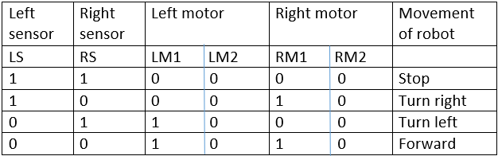
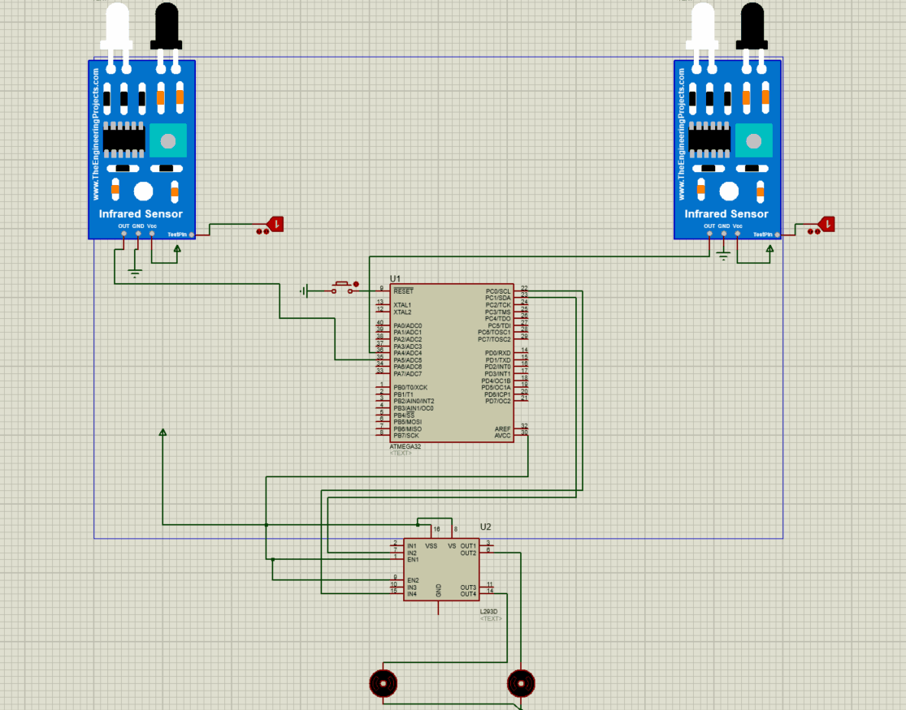

# Micro_projects
These are our group's mini project which relates to microprocessor course in university.

Author : Ali Ghadiri, Afrooz Sheikholeslami

Language : C

# **Project 1, simple calculator using atmega32**

In this project we tried to simulate a simple calculator in proteus using atmega32.

# **PreRequirements**

For This Project You Need below Requirements :
- proteus softwawre version 8
- codevison or any text editor to see the code.

# **Usage**
## Step0 : Cloning

First of All Clone the Project : 

```shell
$ git clone https://github.com/AliGhadirii/Micro_projects.git
```

## Step1 : 

You can simply run the "final.pdsprj" file and work with this calculator in proteus.

# **Project 2, Door bell using atmega32**

In this project we tried to simulate a simple digital door bell in proteus using atmega32.

# **PreRequirements**

For This Project You Need below Requirements :
- proteus softwawre version 8
- codevison or any text editor to see the code.

# **Usage**
## Step0 : Cloning

First of All Clone the Project : 

```shell
$ git clone https://github.com/AliGhadirii/Micro_projects.git
```

## Step1 : 

You can simply run the "Q1.pdsprj" file and work with this calculator in proteus.

# **Project 3, sin wave generator using atmega32**

In this project we tried to simulate a simple sin door wave generator using initial timers of atmega32 in PWM mode.

# **PreRequirements**

For This Project You Need below Requirements :
- proteus softwawre version 8
- codevison or any text editor to see the code.

# **Usage**
## Step0 : Cloning

First of All Clone the Project : 

```shell
$ git clone https://github.com/AliGhadirii/Micro_projects.git
```

## Step1 : 

You can simply run the "Q3.pdsprj" file and work with this calculator in proteus.

# **Project 4, generate Heartrate wave using atmega32**

In this project we tried to generate haertwave rate using initial ADC of atmega32.

# **PreRequirements**

For This Project You Need below Requirements :
- proteus softwawre version 8
- codevison or any text editor to see the code.

# **Usage**
## Step0 : Cloning

First of All Clone the Project : 

```shell
$ git clone https://github.com/AliGhadirii/Micro_projects.git
```

## Step1 : 

You can simply run the "Q4_b.pdsprj" file and work with this calculator in proteus.

# **Project 5, Line follower robot using atmega32**

In this project we tried to simulate a robot which follows balack line using IR sensors and DC motor.

# **PreRequirements**

For This Project You Need below Requirements :
- proteus softwawre version 8
- codevison or any text editor to see the code.

# **Usage**
## Step0 : Cloning

First of All Clone the Project : 

```shell
$ git clone https://github.com/AliGhadirii/Micro_projects.git
```

## Step1 : 

Open "P5.pdsprj" file using proteus.

## Step2 : 

Right click on each IR sensor and program them with "InfraredSensorsTEP.HEX".

## Step3 : 

Right click on the atmega32 and program it with .hex file of the given "pro.c" file.
Then run the program.<br />
Here is the table of states that we have:<br /> 

<br /><br />



# **Support**

Reach out to me at one of the following places!

- Telegram at <a href="https://t.me/Aliighadiri" target="_blank">@Aliighadiri</a>
- Gmail at <a href="mailto:ali.ghadiri78@gmail.com" target="_blank">ali.ghadiri78@gmail.com</a>


